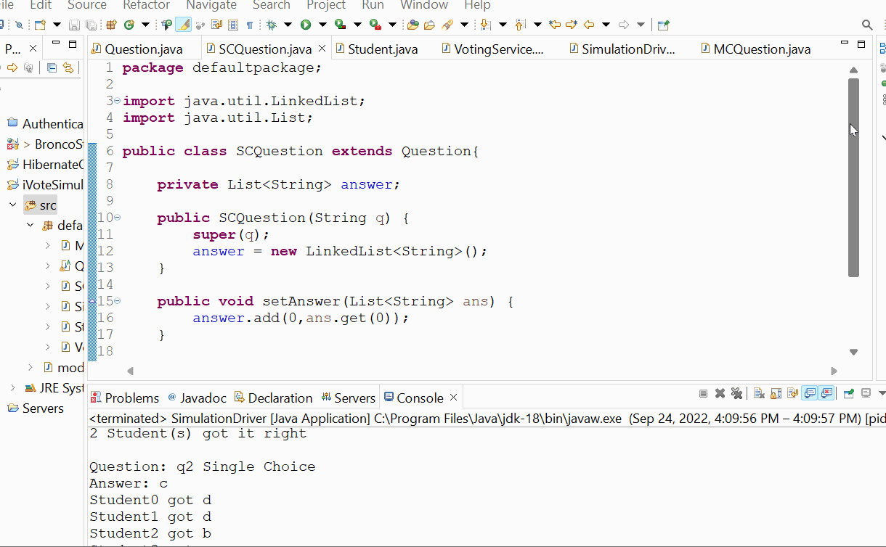

# hw1CS3560

Contained in the defaultPackage

Framework:
* Question.java is an abstract class that parents two classes; that being SCQuestion and MCQuestion
* SCQuestion.java is a sub class of Question and is suppose to signify a question and contains an answer to the question.
* MCQuestion.java is a sub class of Question and is suppose to signify a question and the the correct choices for the answer.
* Student.java is a class that houses a unique studentId, and an answer. Everytime a Student is initialized a static integer will increase, assuring a unique ID.
* VotingSimulator.java is a class that will take in a Question and multiple Students for that question. With its methods it can print out which the student answers
and compares them with the Question answer to determine whether it is correct. When a student is added to the VotingSimulator's list, it will check if the student 
is already in it and will just replace it.
* SimulationDriver.java is a class that will make dummy questions and students to test the classes above. It is the main class.

## Video Walkthrough

Here's a walkthrough of the code:

GIF created with [LiceCap](https://www.cockos.com/licecap/) 
